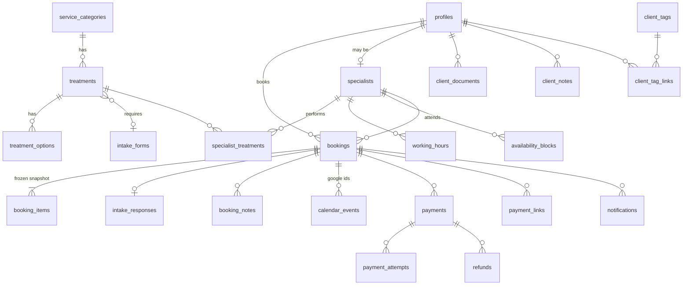

# BLOOM Booking Platform: Phase 1 proposal

Status: **approved 2026-09-28** (decisions recorded in §6) · Date: 2026-09-28

This document covers Phase 1: repo analysis, the extracted catalog, the target architecture
and the Supabase data model. `supabase/seed.sql` holds the catalog, which depends on the schema in §4.

---

## 1. Repository analysis

| Aspect | Finding |
| --- | --- |
| Framework | **Vite 7 + React 19 SPA** with `react-router-dom` 6. **Not Next.js.** |
| Hosting | Vercel, static build, `vercel.json` rewrites every path to `index.html`. |
| Language | TypeScript, `strict: true`. |
| Styling | Tailwind CSS **3.4**, custom tokens in `tailwind.config.js` (`cocoa #31251B`, `ink #231B15`, `cream`, `sand`, `stone`, `taupe`, `latte`, `bronze`, `muted`, `accent`), component classes in `src/index.css` (`btn-dark`, `btn-light`, `container-site`, `heading-*`, `sheen`). |
| Fonts | Cormorant Garamond (serif, italic accents) + Plus Jakarta Sans, from Google Fonts. |
| Motion | Custom `Reveal`, `SplitText`, `ParallaxImage`, `CountUp`, Lenis smooth scroll. |
| Content | Hard-coded in `src/data/*.ts` (`treatments.ts`, `treatmentPages.ts`, `site.ts`, `faqs.ts`, `testimonials.ts`). |
| Routes | `/`, `/treatments/:slug`, and placeholders (`ComingSoon`) for `/booking`, `/privacy`, `/terms`, `/intake-form`. |
| Booking CTAs | Every "Book now" / "Book your skin consultation" links to `/booking` without passing a treatment. |
| Backend | None. No env vars, no API, no tests. |
| Placeholders | `site.ts` phone/WhatsApp (`+1 (123) 123-456`) and email are Figma placeholders. FAQ answers 2–7 are drafts. Social links point to bare domains. |

### 1.1 Key consequence: the stack requires a migration

The brief mandates Next.js App Router (Server Components, Route Handlers, Server Actions,
`@supabase/ssr` cookie sessions, middleware). The site is a Vite SPA, so there are two options:

| Option | What it means | Verdict |
| --- | --- | --- |
| **A. Migrate to Next.js** (recommended) | Move the existing pages into `app/(marketing)/` 1:1. Components stay the same; only routing glue changes (`react-router` `Link`/`useLocation` → `next/link`/`usePathname`, static image imports → `.src`, animated components marked `'use client'`). Pixel parity checked page by page against the live site before anything else ships. | Matches the brief. Secure cookie sessions, server-only secrets, webhooks and SSR catalog pages (better SEO) all come for free. ~1 day of work, low visual risk. |
| B. Keep Vite | All server logic moves to Supabase Edge Functions; sessions live in `localStorage`; `/admin` protection is client-side only (data still protected by RLS). | Works, but weaker session security, no SSR, and contradicts the mandated stack. |

**Proposal:** do Option A as the first step of Phase 2, as its own commit, before any auth work.
Tailwind stays on v3 during the migration (no visual churn); shadcn/ui components are
added in v3-compatible form and themed with the existing tokens.

---

## 2. Extracted catalog

Source of truth: `src/data/treatments.ts` and `src/data/treatmentPages.ts`. Seeded in
`supabase/seed.sql`. **4 categories, 23 treatments (the 22 menu items plus the laser session), 13 laser-area options.**

### 2.1 Categories

| Slug | Name | Items on site |
| --- | --- | --- |
| `facials` | Facials & Skin Health | 13 |
| `brows-lips` | Brows & Lips | 6 (Brows 3, Lips 3) |
| `diode-laser` | Diode Laser Hair Removal | 13 areas (Face 6, Body 7) |
| `intimate-care` | Intimate Skin Care | 3 |

### 2.2 Treatments and prices (verbatim from the site)

**Facials & Skin Health**: no per-treatment description on the site.

| Treatment | Price | Best seller |
| --- | --- | --- |
| Microneedling | $250 | ✓ |
| Face Peeling (Mesopeel) | $240 | |
| Hydrodermabrasion Treatment | $180 | ✓ |
| Hydrating Facial | $180 | |
| Back Facial | $180 | |
| Dermaplaning Treatment | $175 | ✓ |
| Autumn Glow Facial | $175 | |
| Oxygen Infusion Facial | $170 | |
| Pumpkin Peel Facial (Vitamin A) | $160 | |
| Vitamin C Facial | $150 | |
| Microdermabrasion Treatment | $140 | |
| Skin Revival Facial | $135 | |
| My Signature Facial | $120+ (starting price) | |

Menu note: *"Prices marked "+" are starting prices. Your final protocol is confirmed at your consultation."*

**Brows & Lips**

| Group | Treatment | Price | Description |
| --- | --- | --- | --- |
| Brows | Shadow Brows ✓ | $600 | A soft, powdered finish for a defined, filled-in look. |
| Brows | European Brows | $600 | Fine hair strokes that recreate natural brow hairs. |
| Brows | Laminated Brows | $110 | Lifts and sets your natural brows for a brushed-up look. |
| Lips | Watercolor Lips | $500 | Sheer, blended color that enhances your natural tone. |
| Lips | Full Lips | $600 | Full, defined color with a perfected lip line. |
| Lips | Korean Lips | $490 | A soft gradient, deeper at the center, for a fresh look. |

Menu note: *"Touch-up recommendations are discussed during your consultation."*

**Diode Laser Hair Removal**: "Laser pricing, per session", every price is a starting price.

| Face | Price | Body | Price |
| --- | --- | --- | --- |
| Upper Lip | $40+ | Half Leg | $50+ |
| Chin | $45+ | Underarms | $55+ |
| Sideburns | $45+ | Full Arm | $55+ |
| Full Face | $50+ | Bikini | $60+ |
| Neck | $60+ | Upper Chest | $70+ |
| Beard | $80+ | Full Leg | $80+ |
| | | Back | $100+ |

**Intimate Skin Care**

| Treatment | Price | Description |
| --- | --- | --- |
| Vajacial (Intimate Facial) ✓ | $120 | Deep cleansing for the bikini area: exfoliation, ingrown-hair care and soothing hydration. |
| Underarm Depigmentation | $1,100 | A progressive protocol that lightens dark underarms and evens out skin tone. |
| Intimate Area Depigmentation | $1,250 | Gentle, progressive lightening that restores an even tone to delicate areas. |

Business hours (site footer): **Monday–Saturday, 10:00–20:00**. Address: 305 E 204th St, Suite 2A, Bronx, NY 10467.

### 2.3 Laser model (approved)

The site prices laser **per area, per session**, and clients commonly combine areas in one visit.
Proposal: one bookable treatment, **"Diode Laser Hair Removal Session"**, base price $0, where the client
selects **one or more areas** as options (grouped Face/Body). Total = sum of areas; duration = sum of
area durations. This is exactly the "Customization" step in the brief.
The alternative (13 separate treatments) would force one booking per area.

### 2.4 Pending data (the site does not provide it; I did not invent it)

| # | Missing data | Affects | Blocking? |
| --- | --- | --- | --- |
| P1 | **Duration** for all 22 treatments and 13 laser areas | Availability engine | No: **estimated** in the seed (see §2.5), editable in the back office |
| P2 | **Buffers** before/after (cleanup, prep), per treatment or a global default | Availability | No: estimated (15 min after), editable |
| P3 | **"What's included"** for every treatment (the site only has one-line descriptions for 9 of them, none for facials or laser) | Treatment cards | No |
| P4 | **Add-ons / extras** for facials or others (the brief mentions "facial extras"; the site lists none) | Customization step | No |
| P5 | **Specialist**: one (confirmed). Display name and photo still pending | Calendar, emails | No: seeded as "BLOOM Beauty Skin", editable |
| P6 | **Intake/consent questions** per treatment (laser, micropigmentation, peels, depigmentation) | Confirmation step | Yes for treatments that require it |
| P7 | **Policy values**: cancel/reschedule cutoff hours, max reschedules, minimum notice, max window, reminder offsets | Rules | No: defaults in §2.5, editable |
| P12 | **Charge amount at booking**: full estimated total or a deposit | Payment step | No: default full total, deposit configurable per treatment |
| P8 | Real **phone, WhatsApp, email**, social links (current values are placeholders) | Emails, .ics, contact CTAs | Yes before launch |
| P9 | **Terms of service, privacy policy, cancellation policy** texts | Onboarding checkbox, Google verification | Yes before launch |
| P10 | **Deposit** per treatment (if any) | Payments phase | No |
| P11 | Price for **touch-ups** (brows/lips) | Catalog | No |

### 2.5 Estimated values (owner asked for estimates, all editable in the back office)

Durations in minutes. Every value is flagged `ESTIMATE` in `seed.sql`.

| Treatment | Min | Treatment | Min |
| --- | --- | --- | --- |
| Microneedling | 75 | Shadow / European Brows | 150 |
| Face Peeling (Mesopeel) | 60 | Laminated Brows | 45 |
| Hydrodermabrasion | 60 | Watercolor / Full / Korean Lips | 150 |
| Hydrating, Back, Autumn Glow, Oxygen, Pumpkin, Vitamin C, Skin Revival, Signature | 60 | Vajacial | 45 |
| Dermaplaning | 45 | Underarm / Intimate Depigmentation | 60 |
| Microdermabrasion | 45 | Laser session (base prep) | 10 |

Laser areas (added to the 10 min base): Upper Lip 5, Chin 5, Sideburns 5, Full Face 15, Neck 10, Beard 15,
Half Leg 20, Underarms 10, Full Arm 20, Bikini 15, Upper Chest 15, Full Leg 40, Back 30.

Buffers: 0 before, 15 after, for every treatment.

Settings defaults: slot interval 15 min · minimum notice 2 h · booking window 60 days · hold 10 min ·
cancel/reschedule cutoff 24 h · max 2 reschedules per booking · reminders 24 h and 2 h.

---

## 3. Target architecture

```
                          ┌──────────────────────────── Vercel ────────────────────────────┐
 Browser (mobile-first)   │ Next.js App Router                                             │
 ─────────────────────    │  app/(marketing)   public site (SSR, reads catalog from DB)    │
  Server Components  ◄────┤  app/(booking)     /book flow                                  │
  TanStack Query          │  app/(client)      /dashboard, /onboarding, /profile           │
  Supabase browser client │  app/admin         back office (staff/admin)                   │
  (anon key, RLS)         │  app/api/*         Route Handlers: OAuth callbacks, webhooks,  │
                          │                    job worker, .ics, CSV export                │
                          │  middleware.ts     session refresh + route guards              │
                          └───────┬───────────────────────────────┬────────────────────────┘
                                  │ @supabase/ssr (user JWT)      │ service role (server only)
                          ┌───────▼───────────────────────────────▼────────────────────────┐
                          │ Supabase                                                        │
                          │  Postgres + RLS · RPCs (booking txns) · audit triggers          │
                          │  Auth (Google) · Vault (OAuth refresh tokens) · Storage (docs)  │
                          │  Realtime (bookings) · pg_cron + pg_net (schedules, worker tick)│
                          └───────┬─────────────────────┬───────────────────┬──────────────┘
                                  │                     │                   │
                        Google Calendar API        Resend (email)      Stripe (test mode)
                        (push + syncToken)         + webhooks          + webhooks
```

### 3.1 Folder layout

```
app/
  (marketing)/            existing pages, migrated 1:1
  (booking)/book/         step-by-step flow
  (client)/dashboard/  onboarding/  profile/
  admin/                  dashboard, calendar, bookings, clients, catalog, team, settings, audit, integrations
  api/
    auth/callback/        Supabase OAuth code exchange
    google/connect|callback/   calendar consent (client + business)
    google/notifications/ watch-channel push receiver
    webhooks/stripe|resend/
    jobs/run/             worker, called by pg_cron every minute (secret-protected)
    bookings/[id]/ics/
lib/
  supabase/{browser,server,admin}.ts   three clients; admin.ts has `import 'server-only'`
  availability/           pure TS slot engine (unit-tested)
  booking/                zod schemas, server actions calling RPCs
  google/                 OAuth, token refresh, calendar client, sync
  notifications/          channel-agnostic dispatcher; email (Resend) now, SMS/WhatsApp later
  payments/               PaymentProvider interface + StripeProvider
  audit/                  app-level event logger
  i18n/                   next-intl, `en` now, `es` ready
emails/                   React Email templates
supabase/
  migrations/  seed.sql  tests/ (pgTAP)
tests/  unit/ (Vitest)  e2e/ (Playwright)
```

### 3.2 Technical decisions where I propose something better than, or more specific than, the brief

1. **Google Calendar consent via our own OAuth flow, not via Supabase sign-in tokens.**
   Supabase only hands out `provider_refresh_token` once, at sign-in, and asking for
   `calendar.events` at sign-in would make every client face a sensitive-scope consent screen.
   Proposal: sign-in uses Supabase Google with basic scopes (`openid email profile`). "Connect Google
   Calendar" (optional, after onboarding or from the profile) runs our own route
   (`/api/google/connect`) with `access_type=offline`, `prompt=consent`, `include_granted_scopes=true`,
   scope `calendar.events`. The refresh token goes straight into **Vault**. The same flow, with a
   different scope and admin-only access, connects the business calendar.
   Clients who do not connect get `.ics` emails, as required.

2. **Holds and bookings live in the same table** (`bookings.status = 'held'` with `hold_expires_at`),
   so **one** `EXCLUDE` constraint covers both. Postgres cannot use `now()` in a constraint, so
   expired holds are released by (a) the booking RPC itself, which expires stale holds that overlap
   the requested range inside the same transaction, and (b) a pg_cron sweep every minute.

3. **The exclusion range includes buffers**: `blocked_range = [start − buffer_before, end + buffer_after)`,
   so buffers are enforced by the database, not only by the UI.

4. **Profiles are decoupled from `auth.users`**. Admins must be able to create bookings for new clients
   who have never logged in, and deleting an account must keep the booking history. So
   `profiles.id` is its own uuid, and `profiles.user_id` references `auth.users` (nullable, `on delete set null`).
   On sign-up, the trigger links to an existing admin-created profile when the **verified** Google email matches.

5. **Google busy time is mirrored into the database.** Business-calendar events not created by us are
   stored as `availability_blocks` (source `google`) by the sync. The slot engine and the booking RPC
   then check a single source, and a booking never makes a network call inside a transaction.

6. **Slots computed in TypeScript, enforced in SQL.** `lib/availability` is a pure function
   (working hours, blocks, buffers, notice, window, DST) with thorough Vitest coverage. The booking
   RPC re-validates the same rules in SQL plus the exclusion constraint, so the DB is the final authority.

7. **Scheduling via pg_cron, not Vercel Cron.** Vercel Hobby cron only runs daily. pg_cron handles
   DB-only jobs directly (expire holds, expire payment links, flag past bookings, enqueue reminders)
   and, every minute, calls `/api/jobs/run` through `pg_net` with a shared secret to drain the `jobs`
   outbox (Google sync, emails) with exponential backoff.

8. **Audit context from request headers.** PostgREST exposes request headers to Postgres
   (`current_setting('request.headers')`), so the generic trigger records IP, user agent and an
   `x-correlation-id` header set by our server, with no extra plumbing.

9. **Rate limiting in Postgres** (a small fixed-window counter function) instead of adding a new vendor.
   It covers booking RPCs, auth callbacks and webhooks.

10. **Booking-level idempotency**: each booking attempt carries a client-generated `idempotency_key`
    (unique). Retrying the same confirm returns the same booking.

---

## 4. Supabase data model

### 4.1 Schemas

- `public`: business tables, all with RLS enabled.
- `private`: not exposed through the API. Holds OAuth credential references (Vault secret ids),
  role helper functions and internal job functions.
- `vault`: Supabase Vault, encrypted refresh tokens.

### 4.2 Enums

```
user_role        client | staff | admin
price_type       fixed | from
booking_status   held | pending_payment | confirmed | completed | cancelled | no_show | expired
booking_source   online | admin
payment_status   unpaid | pending | paid | partially_paid | refunded | failed
link_status      created | sent | opened | paid | expired | cancelled
job_status       queued | running | succeeded | failed | dead
actor_type       user | admin | staff | system
calendar_kind    business | specialist | client
block_source     manual | google | holiday
```

(`unpaid` is added to the brief's list for bookings where no payment has been requested yet,
for example pay in store.)

### 4.3 ER diagram



### 4.4 Tables

Every business table has `id uuid pk default gen_random_uuid()`, `created_at`, `updated_at`
(trigger), and `deleted_at` where soft delete applies. Money is `integer` cents plus `currency char(3) default 'USD'`.
Times are `timestamptz` (UTC); weekly hours are `time` values interpreted in the business time zone.

**Identity**

| Table | Key columns |
| --- | --- |
| `profiles` | `user_id → auth.users` (nullable, unique), `email`, `full_name`, `phone_e164`, `role user_role`, `onboarded_at`, `terms_accepted_at`, `terms_version`, `reminders_opt_in`, `locale`, `anonymized_at`, `deleted_at` |
| `private.oauth_credentials` | `owner_kind (client/business)`, `profile_id`, `google_email`, `scopes text[]`, `vault_secret_id`, `access_token_expires_at`, `connected_at`, `revoked_at`. No RLS grant to `anon`/`authenticated`. Read and write only through service-role functions. |

Admin role: `ADMIN_EMAILS` env allowlist, applied by a server-side post-login step, plus back-office
role management. The `role` column cannot be changed by the `authenticated` role (column privileges + trigger guard).

**Catalog**

| Table | Key columns |
| --- | --- |
| `service_categories` | `slug unique`, `name`, `short_name`, `description`, `color`, `sort_order`, `is_active` |
| `treatments` | `category_id`, `slug unique`, `name`, `description`, `includes text[]`, `menu_group`, `price_cents`, `price_type`, `duration_minutes` (nullable = pending), `buffer_before_min`, `buffer_after_min`, `deposit_cents`, `min_options`, `max_options`, `intake_form_id`, `is_best_seller`, `is_active`, `sort_order`, `needs_review` (estimated values not yet confirmed), generated `is_bookable` (active and has duration) |
| `treatment_options` | `treatment_id`, `slug unique`, `group_label`, `name`, `description`, `price_cents`, `price_type`, `extra_duration_minutes`, `is_active`, `sort_order`, `needs_review` |
| `intake_forms` | `slug`, `name`, `version`, `questions jsonb` (typed by a Zod schema), `requires_signature`, `is_active` |
| view `catalog_pending_fields` | Lists catalog rows missing data or flagged `needs_review`, shown in the back office. |

**Team and availability**

| Table | Key columns |
| --- | --- |
| `specialists` | `profile_id` (nullable), `display_name`, `bio`, `color`, `google_calendar_id`, `is_active`, `needs_review` |
| `specialist_treatments` | pk (`specialist_id`, `treatment_id`) |
| `working_hours` | `specialist_id` (null = business default), `iso_weekday 1–7`, `start_time`, `end_time` |
| `availability_blocks` | `specialist_id` (null = whole business), `range tstzrange`, `source block_source`, `reason`, `google_event_id`. Covers holidays, time off, manual blocks and mirrored Google busy time. |
| `business_settings` | Single row: `timezone`, `slot_interval_min`, `min_notice_min`, `max_window_days`, `hold_minutes (10)`, `cancel_cutoff_hours`, `reschedule_cutoff_hours`, `max_reschedules`, `reminder_offsets_min int[]`, `admin_alert_emails text[]`, `payments_enabled`, `terms_version`, contact details |

**Bookings**

| Table | Key columns |
| --- | --- |
| `bookings` | `code` (short human reference), `client_id → profiles`, `specialist_id`, `status`, `source`, `start_at`, `end_at`, `buffer_before_min`, `buffer_after_min`, generated `blocked_range tstzrange`, `hold_expires_at`, `idempotency_key unique`, `subtotal_cents`, `discount_cents`, `adjustment_cents`, `total_cents`, `deposit_due_cents`, `payment_status`, `client_notes`, `reschedule_count`, `cancelled_at`, `cancelled_by`, `cancellation_reason`, `rules_overridden`, `override_reason`, `created_by`, `closure_flagged_at` |
| constraint | `EXCLUDE USING gist (specialist_id WITH =, blocked_range WITH &&) WHERE (status IN ('held','pending_payment','confirmed'))` |
| `booking_items` | Frozen snapshot: `kind (treatment/option/custom)`, `treatment_id`, `option_id` (nullable), `name`, `description`, `includes`, `price_type`, `unit_price_cents`, `duration_minutes`, `sort_order` |
| `intake_responses` | `booking_id`, `form_id`, `form_version`, `answers jsonb`, `signed_at`, `signature_document_id`. Sensitive: read through an RPC that writes an audit entry. |
| `booking_notes` | `booking_id`, `author_id`, `body` (staff only) |
| `calendar_events` | `booking_id`, `kind calendar_kind`, `calendar_id`, `google_event_id`, `etag`, `sync_status`, `last_synced_at`, `last_error` |

**CRM and documents**

`client_notes`, `client_tags`, `client_tag_links`, `client_documents` (`storage_path` in private bucket
`client-documents`, `kind consent/other`, `booking_id`, `uploaded_by`). Lifetime spend is a view over paid payments.

**Payments**

| Table | Key columns |
| --- | --- |
| `payments` | `booking_id`, `provider`, `kind (deposit/full/balance/in_store)`, `amount_cents`, `status`, `provider_ref` |
| `payment_attempts` | `payment_id`, `provider_ref`, `status`, `error`, `raw jsonb` |
| `refunds` | `payment_id`, `amount_cents`, `reason`, `provider_ref`, `status` |
| `payment_links` | `booking_id`, `provider_session_id`, `url`, `amount_cents`, `status link_status`, `expires_at`, `sent_at`, `opened_at`, `paid_at` |

**Integrations and infrastructure**

| Table | Purpose |
| --- | --- |
| `notifications` | Every message: `channel (email/sms/whatsapp)`, `template`, `recipient`, `booking_id`, `status`, `provider_message_id`, `error`, delivery/bounce timestamps |
| `jobs` | Outbox: `type`, `payload`, `status`, `attempts`, `max_attempts`, `next_run_at`, `locked_at`, `last_error`, `dedupe_key unique`, `correlation_id`. Claimed with `FOR UPDATE SKIP LOCKED`. |
| `webhook_events` | pk (`provider`, `event_id`): idempotency for Stripe, Resend and Google |
| `google_watch_channels` | `calendar_id`, `channel_id`, `resource_id`, `token`, `expires_at`, `sync_token` |
| `rate_limits` | `key`, `window_start`, `count` |
| `audit_log` | `id bigint identity`, `occurred_at`, `actor_profile_id`, `actor_type`, `actor_role`, `action`, `entity_type`, `entity_id`, `before jsonb`, `after jsonb`, `diff jsonb`, `ip inet`, `user_agent`, `correlation_id`, `metadata` |

### 4.5 Critical RPCs (single transaction, `security definer`, strict `search_path`)

| RPC | Does |
| --- | --- |
| `hold_slot(treatment, options[], specialist?, start_at, idempotency_key)` | Recomputes price and duration from the catalog, validates rules, picks a specialist if "any", expires stale overlapping holds, inserts `held` booking with snapshot. Returns the hold. |
| `submit_booking(booking_id, notes, intake_answers)` | Checks the hold belongs to the caller and has not expired, validates required intake. If payments are enabled: moves to `pending_payment` and extends `hold_expires_at` to the checkout expiry. If payments are disabled (feature flag): confirms directly. |
| `mark_booking_paid(booking_id, payment)` | Service role only, called by the verified Stripe webhook. Records the payment and sets `confirmed`, then enqueues calendar sync and emails. A payment that arrives after the hold expired and the slot was taken is refunded automatically and the client is notified. |
| `staff_confirm_booking(booking_id, reason)` | Staff confirms without online payment (pay in store). Audited. |
| `reschedule_booking(booking_id, new_start, specialist?)` | Policy (cutoff, max reschedules), moves the range in place (the constraint guarantees the new slot), increments counter, enqueues jobs. |
| `cancel_booking(booking_id, reason)` | Policy check for clients, bypass for staff, enqueues jobs. |
| `admin_create_booking(...)` | Existing or new client, catalog or custom items, manual price/discount, optional `override_rules` with a required reason (audited). |
| `set_booking_status(booking_id, status)` | completed / no_show / confirmed (staff). |

### 4.5.1 Booking lifecycle (confirmed on payment)

```
 pick slot ──► held (10 min) ──► pending_payment ──► confirmed ──► completed / no_show
                 │                  │ (Stripe Checkout, 30 min, Stripe's minimum)
                 └── expired ◄──────┘ (not paid in time: slot released)
 any active state ──► cancelled
```

- Calendar events and "booking confirmed" emails are only sent on `confirmed`.
  `pending_payment` bookings appear in the admin calendar as tentative.
- Amount charged: the estimated total by default, or the treatment's deposit when one is set.
  "From" prices are charged at the starting price. Staff adjust the final price in the back office
  and collect the difference in store or with a payment link.
- Consequence for the phases: a minimal Stripe Checkout moves into **Phase 3** (the booking flow cannot
  finish without it). Phase 6 keeps refunds, admin payment links, deposits UI and the provider abstraction.
  Until Stripe keys exist, the `payments_enabled` flag is off and bookings confirm directly.

### 4.6 RLS summary

| Data | client | staff | admin |
| --- | --- | --- | --- |
| Active catalog, business hours | read (also `anon`) | read all | CRUD |
| Own profile | read, update (not `role`) | all clients: read | all |
| Own bookings, items, payments, links | read (writes only via RPC) | read all, write via RPC | all |
| Intake responses, documents | own | read (audited) | all |
| Notes, tags, CRM | none | read and write | all |
| Settings, team | none | read | CRUD |
| `audit_log` | none | none | read only (nobody can update or delete) |
| `jobs`, `webhook_events`, credentials | none | none | read `jobs` status only |

Helpers: `private.current_profile_id()`, `private.is_staff()`, `private.is_admin()` (`security definer`, `stable`).
RLS is proven by pgTAP tests (a client cannot read or modify another client's rows).

### 4.7 Scheduled jobs (pg_cron)

| Every | Job |
| --- | --- |
| 1 min | Expire holds and unpaid `pending_payment` bookings · call `/api/jobs/run` (drain outbox: calendar sync, emails, retries with backoff) |
| 5 min | Enqueue due reminders (per `reminder_offsets_min`), idempotent by `dedupe_key` |
| 15 min | Expire payment links · Google incremental sync (`syncToken`) fallback |
| 1 h | Flag past `confirmed` bookings as pending closure |
| 6 h | Renew Google watch channels expiring within 24 h |

---

## 5. External prerequisites to start now (they have lead times)

1. **Custom domain.** Google will not accept `*.vercel.app` as an authorized domain for the OAuth consent
   screen, and Resend needs a domain you control to send email. This blocks Google verification and email.
2. **Google OAuth verification.** `calendar.events` is a *sensitive* scope. Unverified apps show a warning
   screen and are capped at 100 users. Verification requires the domain, privacy policy and terms pages, and takes days to weeks.
3. **Business Google account.** If it is Google Workspace, a service account with domain-wide
   delegation is possible. With a `@gmail.com` account (the site shows one), use the admin OAuth connect flow (my default).
4. **Supabase plan.** Two projects (staging and production). PITR requires the Pro plan plus the PITR add-on.
   Vault, pg_cron and pg_net are available on all plans.
5. **Stripe account** (test mode is enough for Phase 6).

---

## 6. Decisions log (owner, 2026-09-28)

| # | Question | Decision |
| --- | --- | --- |
| 1 | Next.js or Vite | **Migrate to Next.js** (Option A). |
| 2 | Laser model | **One session, the client picks areas.** |
| 3 | Multiple areas / "from" prices | **Selected areas add up.** "From" prices are charged at the starting price; staff adjust afterwards. |
| 4 | "Book your skin consultation" CTAs | **Redirect to WhatsApp.** Not a bookable service. "Book now" CTAs open the booking flow. |
| 5 | Depigmentation | **Single session** for now. |
| 6 | Seasonal facials | **Always available.** |
| 7 | Specialists / resources | **One specialist.** The specialist step is hidden while only one is active; the model keeps `specialist_id` so more can be added later. |
| 8 | Confirmation | **Confirmed on payment** (see §4.5.1). |
| 9 | Durations and missing values | **Estimate them**, editable in the back office (see §2.5). |
| 10 | Refund when cancelling with notice | **A percentage**, default **90%** (`cancellation_refund_percent`, editable). |
| 11 | Late cancellation / no-show | **No refund** (`late_cancellation_refund_percent = 0`). |
| 12 | Minors | **Allowed with parent/guardian consent**; accounts are 18+, the guardian books and attends. |
| 13 | Privacy contact | **privacy@bloombeautyskinllc.com**. Sender domain `bloombeautyskinllc.com` verified in Resend. |

The Terms and Privacy pages (`/terms`, `/privacy`) render these values from `business_settings` through
`get_public_settings()`, so the published policy always matches what the booking engine enforces.

Still open (non-blocking): full total vs deposit (default: full total), specialist display name,
real contact details, legal texts, intake questions, custom domain.

---

## 7. Implementation status

| Phase | Status | Notes |
| --- | --- | --- |
| 1. Analysis, catalog, schema | Done | Decisions in §6. |
| 2. Auth, onboarding, welcome email | Done | Sign-in and onboarding run in a modal on the current page (`AuthModalProvider`). |
| 3. Availability engine, booking flow, client dashboard | Done | `src/lib/availability` (pure, DST-tested), `/booking`, `/dashboard`, `.ics` + Google Calendar link, profile edit, account deletion. Payments flag off: bookings confirm immediately; `pending_payment` path is wired for phase 6. No booking emails yet (phase 4). |
| 4. Google Calendar sync + notifications | Done | Triggers on `bookings` enqueue jobs (client + staff emails with .ics, reminders, review request, calendar sync). pg_cron → pg_net → `/api/jobs/run` every minute (URL + secret in Vault: `npm run jobs:configure -- <app url>`). Google Calendar: business (admin) and client connections, tokens in Vault, two-way sync by 15-min `syncToken` pull + push channels on HTTPS. Resend delivery webhook (Svix-verified, idempotent). |
| 5. Back office + audit log UI | Done | `/admin` with its own shell. Staff: dashboard, calendar (day/week/month, drag and drop, Supabase Realtime), bookings (filters, CSV, actions, notes), custom bookings (new client, custom service, manual price/discount, rules override with reason), clients (CRM: notes, tags, private documents with signed URLs, history). Admin only: catalog, team & hours, blocks, staff access, settings, activity log (+ CSV). Staff RPCs in `*_back_office.sql`; notify-client flag honored by the outbox. |
| 6. Payments | Done (sandbox) | **Square instead of Stripe**: the business already has a Square account that pays out to its Bank of America account. See §8. |

Treatment page menu rows link to `/booking?treatment=<slug>[&options=<slug>]` (the `book` field in
`src/data/treatmentPages.ts`), so the booking intent survives sign-in.

---

## 8. Payments with Square (2026-10-02)

Square replaces the Stripe plan in §3 and §4.5: the business already takes card payments with Square,
and Square pays out to its Bank of America business account. Nothing is configured on the bank side.

**Flow.** With `payments_enabled` on, `submit_booking` moves the booking to `pending_payment` and keeps
the slot for 30 minutes. The server creates a Square **hosted payment link** (one order per booking,
`reference_id` = booking id, a single line for the amount due: deposit or full price) and redirects the
client to it. After paying, Square sends the client to `/booking/return`, which checks the order with
Square right away and redirects to the dashboard once the booking is confirmed. The client never enters
card details on our site (PCI SAQ A).

**Recording payments.** `public.record_payment` (service role) is the only writer and is idempotent per
Square payment id. It is fed from three places, so one missed path never loses a payment:
the verified webhook (`/api/webhooks/square`, HMAC-SHA256 of URL + body), the return page, and the
`payments.reconcile` job (pg_cron every 2 minutes while links are open, and whenever a booking stops
waiting for payment). Payments for orders that are not ours (in-store sales) are ignored.

**Expiry.** Square payment links never expire, so the reconcile job deletes the link of any booking that
is no longer `pending_payment` (expired, cancelled, confirmed at the studio). A payment that still lands
after the hold expired reinstates the booking if the time is free, otherwise it is refunded in full.

**Refunds.** Cancellations queue a `payment.refund` job with `refund_due_cents` (client: policy
percentage of what was paid; staff: full by default, or policy, or none). Admins can also refund any
amount from the booking page. The worker calls Square with an idempotency key per job and payment, and
`public.record_refund` tracks the status (webhooks update it). Failed refunds alert staff by email.

**Configuration.** One credential set per Square environment: `SQUARE_SANDBOX_ACCESS_TOKEN`,
`SQUARE_SANDBOX_LOCATION_ID`, `SQUARE_SANDBOX_WEBHOOK_SIGNATURE_KEY` and the same with `PRODUCTION`.
Admin › Settings › Payments picks the mode (`business_settings.payments_mode`, test by default) used
for new checkout links; each `payment_links` row stores its `environment`, so syncing, deleting and
refunding a payment always goes to the environment it was made in, even after switching modes. The
webhook accepts either signature key (both subscriptions can point to the same URL). The legacy single
set (`SQUARE_ACCESS_TOKEN`, `SQUARE_LOCATION_ID`, `SQUARE_WEBHOOK_SIGNATURE_KEY`) still works and counts
for `SQUARE_ENVIRONMENT`, or for the sandbox when `SQUARE_APPLICATION_ID` starts with `sandbox-`.
`SQUARE_WEBHOOK_URL` is optional (the exact URL registered in Square; defaults to
`NEXT_PUBLIC_SITE_URL/api/webhooks/square`). Webhook events: `payment.created`, `payment.updated`,
`refund.created`, `refund.updated`. Online payments cannot be switched on in Admin › Settings until the
selected mode has credentials.

**Deposit and balance (2026-10-05).** Online bookings charge `business_settings.deposit_percent`
(40% by default, editable in Settings) unless the treatment has a fixed `deposit_cents`. The rest is
paid after the visit: the client sees "Pay balance" on the dashboard once the appointment has started,
and staff can create a payment link from the booking page (any amount, e.g. after a price adjustment) and
copy it to send by WhatsApp, text or email. `payment_links.kind` is `deposit` or `balance`; a booking has
at most one open link, and creating one for another amount replaces the previous one. Balance links stay
open until paid or until the booking is cancelled; pg_cron polls them only for their first 2 hours, after
that the webhook and the return page record the payment.
The catalog edits the deposit as a percentage per treatment (`treatments.deposit_percent`, prefilled
with the business default; saving the default stores null so the treatment keeps following Settings).
